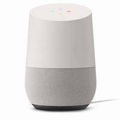

## Biesenbach

[Artsy](https://www.artsy.net) for Google Home.

This project is named after MoMa PS1 curator [Klaus Biesenbach](https://www.moma.org/about/senior_staff/klaus_biesenbach).

### Current Capabilities

#### Launch

* Talk to Artsy

#### Tell me About Andy Warhol

* Tell me about the artist Andy Warhol
* Who is Norman Rockwell?
* Who was the artist Pablo Picasso?

### Your May Also Like

You might also want to check out the [Artsy Alexa App](https://github.com/artsy/elderfield).

### Contributing

We encourage you to contribute! See [CONTRIBUTING](CONTRIBUTING.md) for general guidelines and [DEV](DEV.md) for working with this Google Home app locally.

### License

Copyright (c) 2017 Art.sy Inc.

MIT License, see [LICENSE](LICENSE.md) for details.
